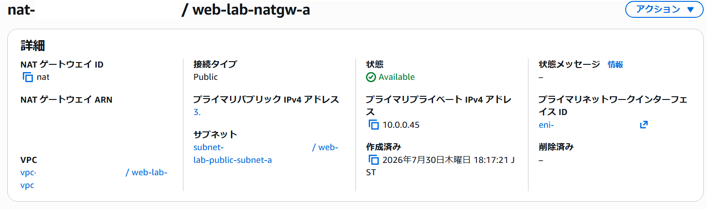
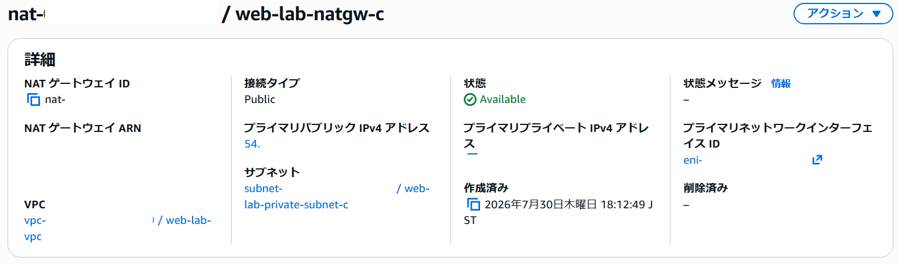

## VPC作成

VPCを作成しました。

## サブネット作成

ap-northeast-1aにパブリックサブネットとプライベートサブネットを作成しました。

---

同様に、ap-northeast-1cにパブリックサブネットとプライベートサブネットを作成しました。

## インターネットゲートウェイ作成

インターネットゲートウェイを作成し、VPCにアタッチしました。

## NATゲートウェイ作成

2つのパブリックサブネットそれぞれにNATゲートウェイを作成し、ElasticIPを割り当てました。

## ルートテーブル作成

パブリックサブネット用ルートテーブルを１つ作成し、2つのパブリックサブネットに関連付けました。

---

プライベートサブネット用ルートテーブルを2つ作成し、2つのプライベートサブネットそれぞれに関連付けました。

## セキュリティグループ作成

ALB用セキュリティグループを作成し、HTTP(80)とHTTPS(443)を許可しました。

---

Webサーバ用セキュリティグループを作成し、HTTP(80)とHTTPS(443)はALB用セキュリティグループからのみ許可しました。

