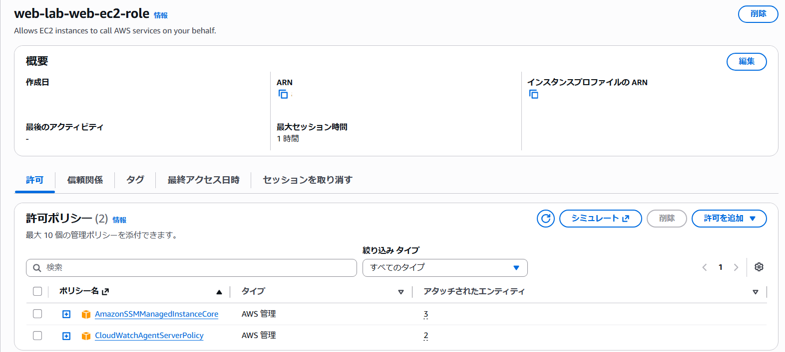
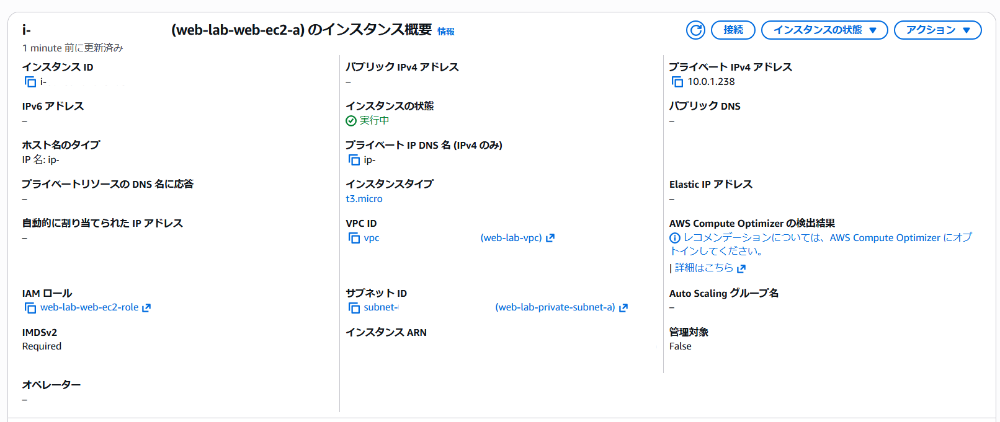
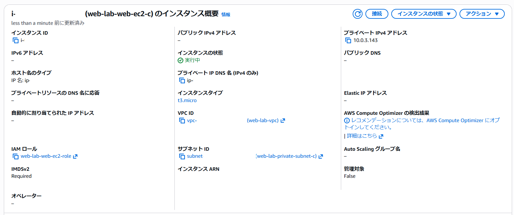

## IAMロール作成

IAMロールを作成し、許可ポリシーとして、AmazonSSMManagedInstanceCore と CloudWatchAgentServerPolicy を付与しました。

---
## EC2インスタンス作成

可用性を考慮し、異なるAZに配置した2つのプライベートサブネットへWebサーバ用EC2インスタンスをそれぞれ作成しました。
両インスタンスには、SSM接続およびCloudWatch Agent利用のため、作成済みのIAMロール(web-lab-web-ec2-role)を設定しました。
