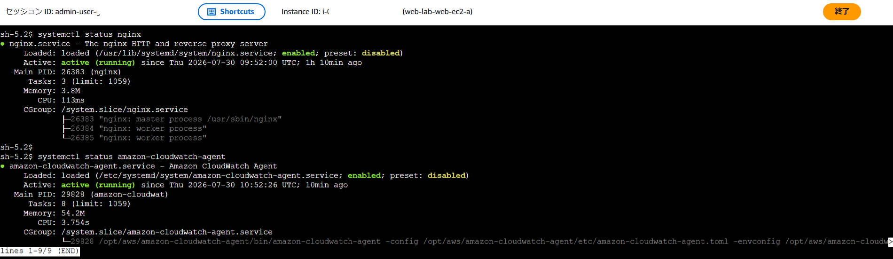
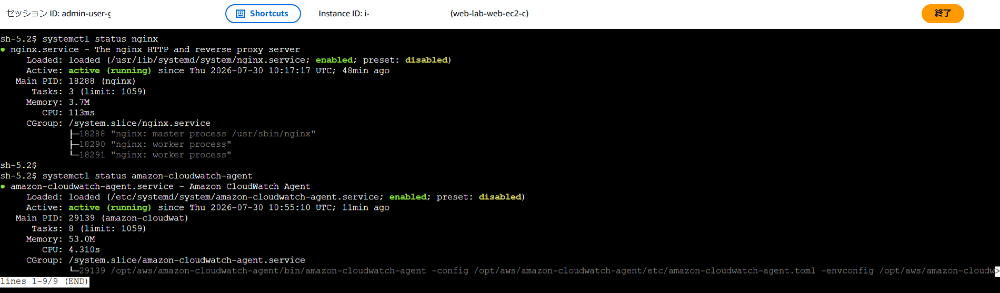

## SSM接続

SSMを使用してEC2インスタンス(web-lab-web-ec2-a/web-lab-web-ec2-c)に接続しました。

---
## Nginx,Cloudwatch Agentインストール

アップデートを確認した後、NginxとCloudwatch Agentをインストール、起動、自動起動の有効化を行いました。

```bash
sudo dnf update -y

sudo dnf install nginx -y
sudo systemctl start nginx
sudo systemctl enable nginx

sudo dnf install amazon-cloudwatch-agent -y
sudo systemctl start amazon-cloudwatch-agent
sudo systemctl enable amazon-cloudwatch-agent
```

---
## Cloudwatch Agent設定

ウィザードを実行し、監視するメトリクスやログ収集の設定を行いました。
その後、作成した設定ファイルを読み込み、CloudWatch Agentを起動しました。

```bash
sudo /opt/aws/amazon-cloudwatch-agent/bin/amazon-cloudwatch-agent-config-wizard

sudo /opt/aws/amazon-cloudwatch-agent/bin/amazon-cloudwatch-agent-ctl \
-a fetch-config \
-m ec2 \
-c file:/opt/aws/amazon-cloudwatch-agent/bin/config.json \
-s
```
---
## Nginx,Cloudwatch Agent起動確認
---

web-lab-web-ec2-aで、NginxとCloudwatch Agentの起動と自動起動の有効化を確認しました。



```bash
systemctl status nginx
systemctl status amazon-cloudwatch-agent
```
---
web-lab-web-ec2-cで、NginxとCloudwatch Agentの起動と自動起動の有効化を確認しました。


```bash
systemctl status nginx
systemctl status amazon-cloudwatch-agent
```
