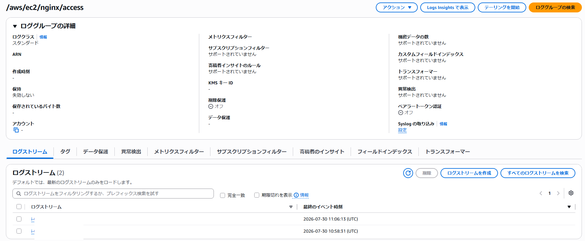
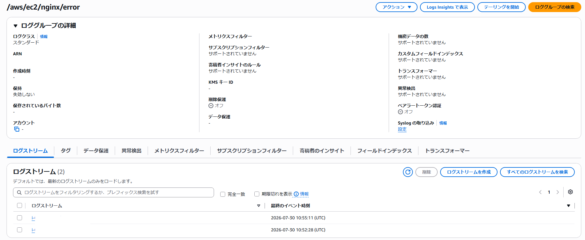
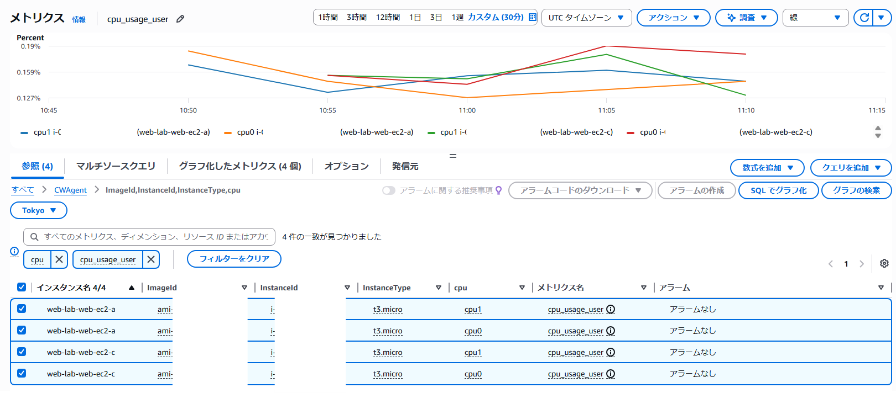

## CloudWatch確認

ロググループ `/aws/ec2/nginx/access` に2つのEC2インスタンスのログストリームが存在することを確認しました。

---

ロググループ `/aws/ec2/nginx/error` に2つのEC2インスタンスのログストリームが存在することを確認しました。

---

CloudWatch Metricsから、EC2インスタンスのCPU使用状況を確認しました。

