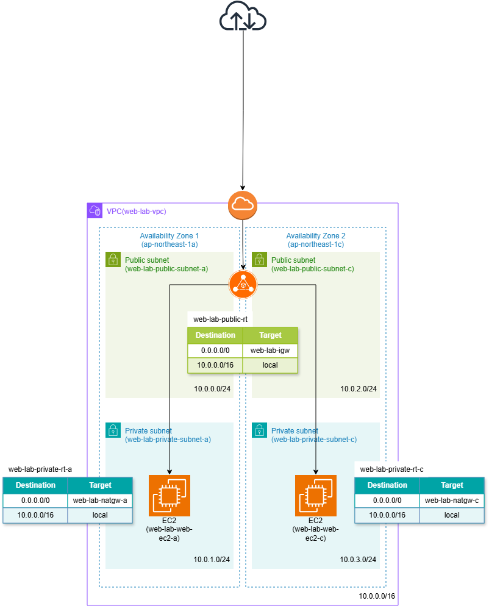

# ALBを利用した高可用性Webシステム

## 概要
AWS上に高可用性を意識したWebサーバ環境を構築しました。

2つのAZに配置したEC2上でNginxを稼働させ、
Application Load Balancer(ALB)を経由してブラウザからアクセスできる構成を作成しました。

また、EC2はプライベートサブネットに配置し、
Systems Manager Session Manager(SSM)を利用して管理を行いました。

## 構成図

## 構築手順

- [01. ネットワーク構築](01-network.md)
- [02. EC2・IAMロール](02-ec2.md)
- [03. ALB・ターゲットグループ](03-alb.md)
- [04. SSM・Nginx・CloudWatch Agent](04-ssm-nginx-cloudwatch-agent.md)
- [05. CloudWatch監視](05-cloudwatch-monitoring.md)
- [06. 動作確認](06-verification.md)
- [07. リソース削除](07-cleanup.md)
