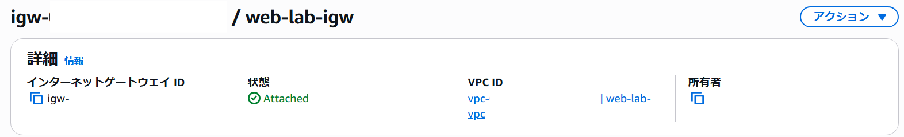
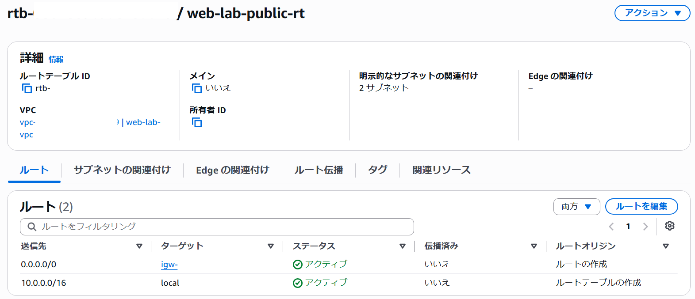
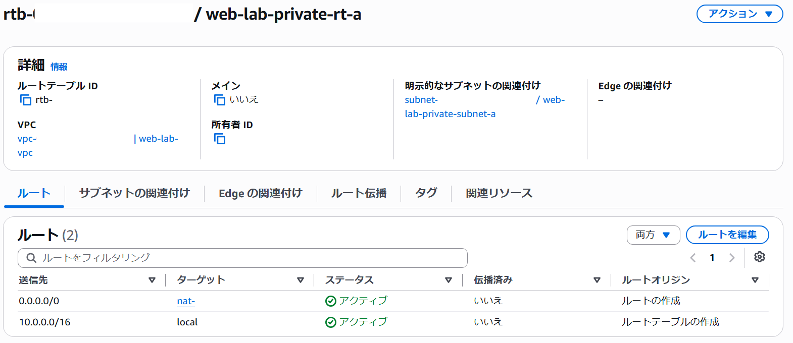
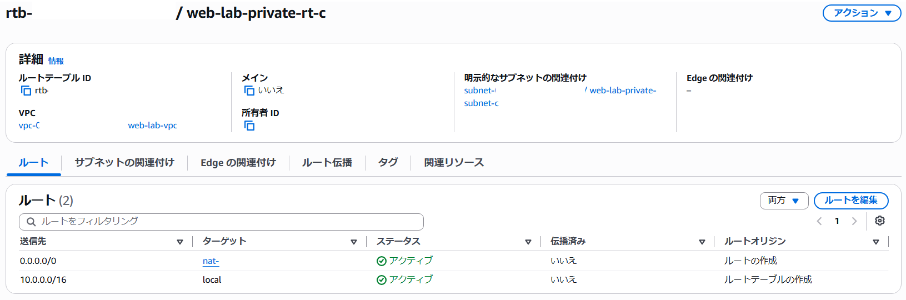
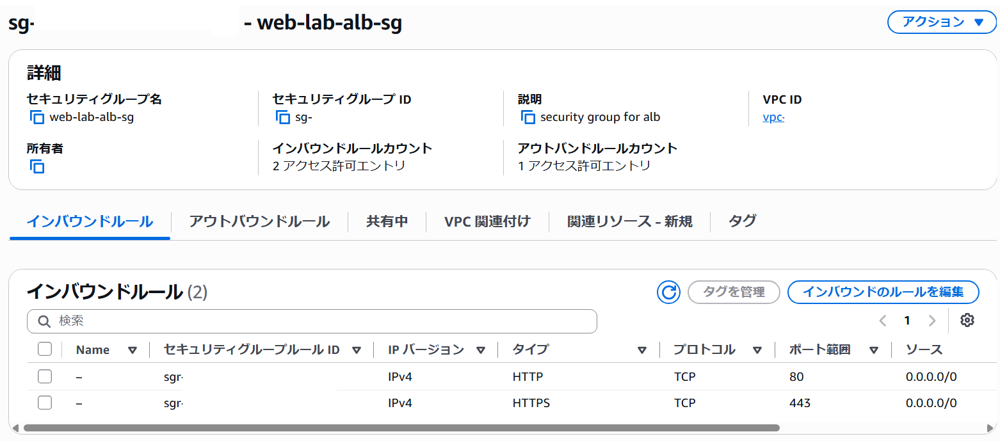
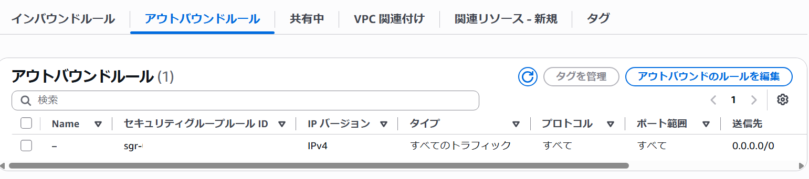
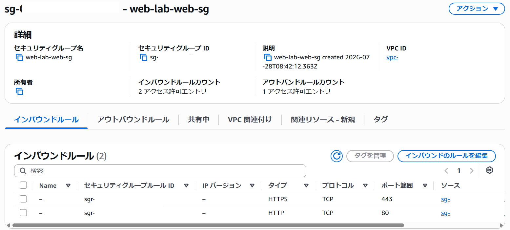
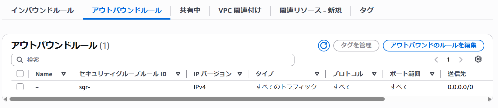

## VPC作成

VPC(10.0.0.0/26)を作成しました。

---
## サブネット作成

ap-northeast-1aにパブリックサブネット(10.0.0.0/24)とプライベートサブネット(10.0.1.0/24)を作成しました。

同様に、ap-northeast-1cにパブリックサブネット(10.0.3.0/24)とプライベートサブネット(10.0.4.0/24)を作成しました。

---
## インターネットゲートウェイ作成

インターネットゲートウェイを作成し、VPC(web-lab-vpc)にアタッチしました。

---
## NATゲートウェイ作成

NATゲートウェイを作成しました。

---
## ルートテーブル作成

パブリックサブネット用ルートテーブルを１つ作成し、2つのパブリックサブネット(web-lab-public-subnet-aとweb-lab-public-subnet-c)に関連付けました。

プライベートサブネット用ルートテーブルを2つ作成し、2つのプライベートサブネット(web-lab-private-subnet-aとweb-lab-private-subnet-c)それぞれに関連付けました。

---
## セキュリティグループ作成

alb用セキュリティグループを作成し、HTTP(80)とHTTPS(443)を許可しました。

webサーバ用セキュリティグループを作成し、HTTP(80)とHTTPS(443)はalb用セキュリティグループからのみ許可した、

