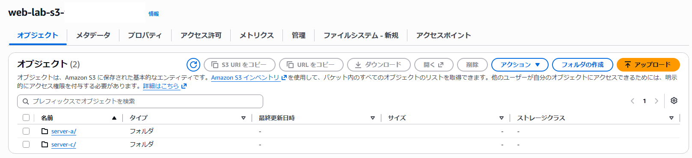

## Parameter StoreにCloudWatch Agentの設定を保存

Parameter Storeのパラメータ `/web-lab/cloudwatch-agent/config` に、CloudWatch Agentの設定ファイルを保存しました。

```json
{
        "agent": {
                "metrics_collection_interval": 60,
                "run_as_user": "root"
        },
        "logs": {
                "logs_collected": {
                        "files": {
                                "collect_list": [
                                        {
                                                "file_path": "/var/log/nginx/access.log",
                                                "log_group_class": "STANDARD",
                                                "log_group_name": "/aws/ec2/nginx/access",
                                                "log_stream_name": "{instance_id}"
                                        },
                                        {
                                                "file_path": "/var/log/nginx/error.log",
                                                "log_group_class": "STANDARD",
                                                "log_group_name": "/aws/ec2/nginx/error",
                                                "log_stream_name": "{instance_id}"
                                        }
                                ]
                        }
                }
        },
        "metrics": {
                "append_dimensions": {
                        "AutoScalingGroupName": "${aws:AutoScalingGroupName}",
                        "ImageId": "${aws:ImageId}",
                        "InstanceId": "${aws:InstanceId}",
                        "InstanceType": "${aws:InstanceType}"
                },
                "metrics_collected": {
                        "cpu": {
                                "measurement": [
                                        "cpu_usage_idle",
                                        "cpu_usage_iowait",
                                        "cpu_usage_user",
                                        "cpu_usage_system"
                                ],
                                "metrics_collection_interval": 60,
                                "resources": [
                                        "*"
                                ],
                                "totalcpu": false
                        },
                        "disk": {
                                "measurement": [
                                        "used_percent",
                                        "inodes_free"
                                ],
                                "metrics_collection_interval": 60,
                                "resources": [
                                        "*"
                                ]
                        },
                        "diskio": {
                                "measurement": [
                                        "io_time"
                                ],
                                "metrics_collection_interval": 60,
                                "resources": [
                                        "*"
                                ]
                        },
                        "mem": {
                                "measurement": [
                                        "mem_used_percent"
                                ],
                                "metrics_collection_interval": 60
                        },
                        "swap": {
                                "measurement": [
                                        "swap_used_percent"
                                ],
                                "metrics_collection_interval": 60
                        }
                }
        }
}
```
---
## S3にWebコンテンツを保存

S3バケットに、各Webサーバ用のindex.htmlを保存しました。

- `/server-a/index.html`：Server A用
- `/server-c/index.html`：Server C用

EC2起動時にUserDataから自身のサーバ用のindex.htmlを取得し、Nginxのドキュメントルートへ配置します。

`/server-a/index.html`

```html
<!DOCTYPE html>
<html>
<head>
<title>Welcome to nginx!</title>
<style>
html { color-scheme: light dark; }
body { width: 35em; margin: 0 auto;
font-family: Tahoma, Verdana, Arial, sans-serif; }
</style>
</head>
<body>
<h1>Welcome to nginx A!</h1>
<p>If you see this page, nginx is successfully installed and working.
Further configuration is required for the web server, reverse proxy,
API gateway, load balancer, content cache, or other features.</p>

<p>For online documentation and support please refer to
<a href="https://nginx.org/">nginx.org</a>.<br/>
To engage with the community please visit
<a href="https://community.nginx.org/">community.nginx.org</a>.<br/>
For enterprise grade support, professional services, additional
security features and capabilities please refer to
<a href="https://f5.com/nginx">f5.com/nginx</a>.</p>

<p><em>Thank you for using nginx.</em></p>
</body>
</html>
```
`/server-c/index.html`

```html
<!DOCTYPE html>
<html>
<head>
<title>Welcome to nginx!</title>
<style>
html { color-scheme: light dark; }
body { width: 35em; margin: 0 auto;
font-family: Tahoma, Verdana, Arial, sans-serif; }
</style>
</head>
<body>
<h1>Welcome to nginx C!</h1>
<p>If you see this page, nginx is successfully installed and working.
Further configuration is required for the web server, reverse proxy,
API gateway, load balancer, content cache, or other features.</p>

<p>For online documentation and support please refer to
<a href="https://nginx.org/">nginx.org</a>.<br/>
To engage with the community please visit
<a href="https://community.nginx.org/">community.nginx.org</a>.<br/>
For enterprise grade support, professional services, additional
security features and capabilities please refer to
<a href="https://f5.com/nginx">f5.com/nginx</a>.</p>

<p><em>Thank you for using nginx.</em></p>
</body>
</html>
```
