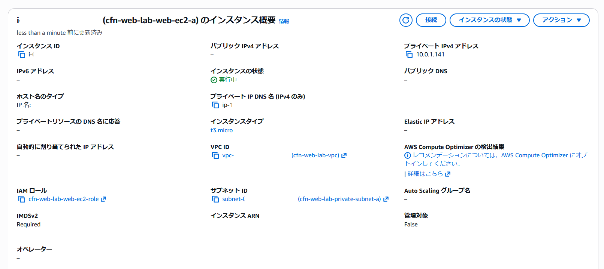
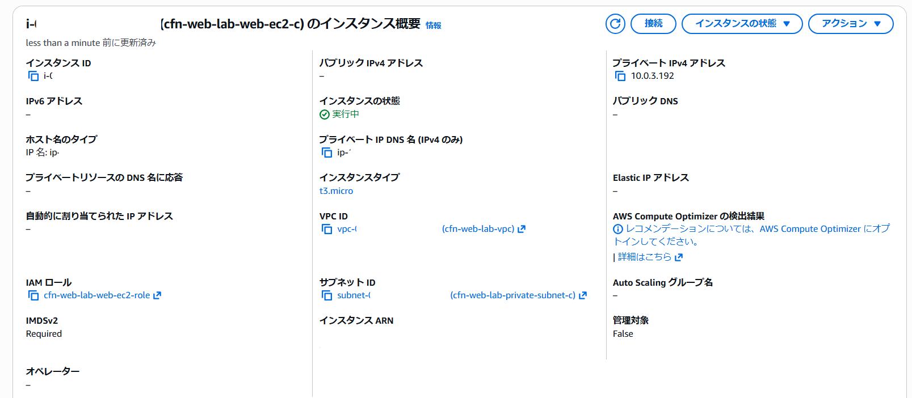
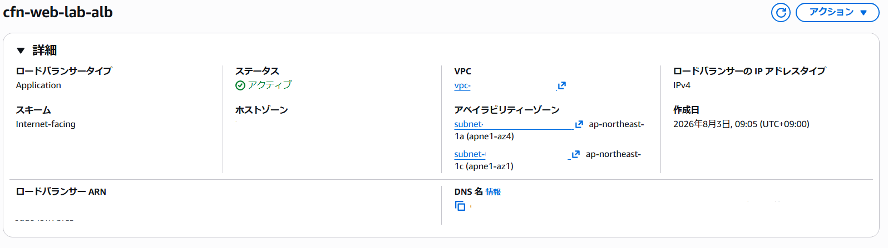
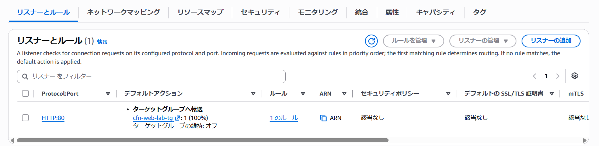
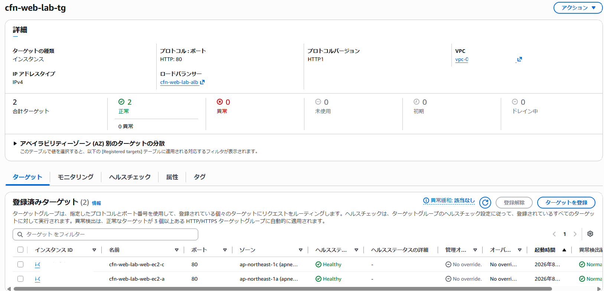
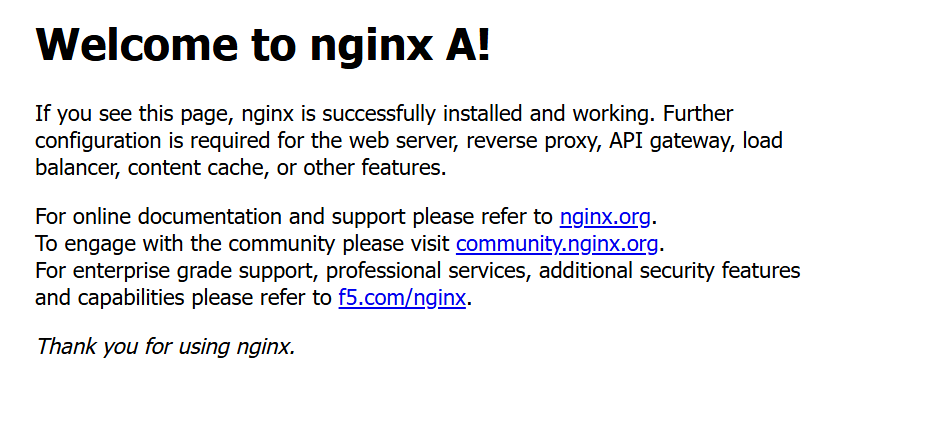
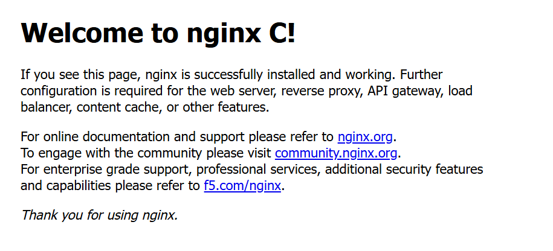
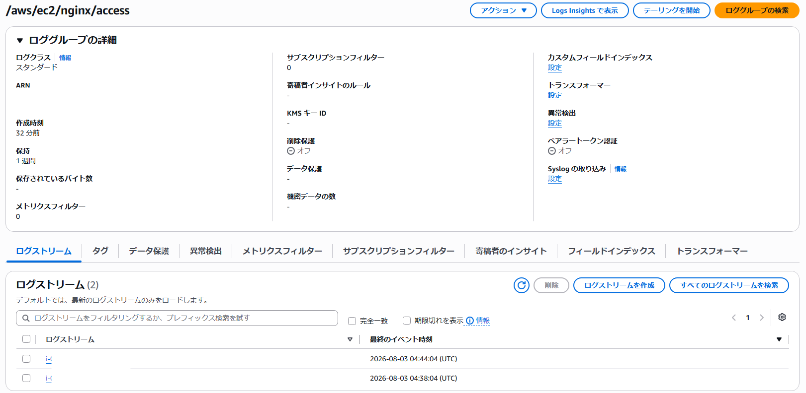
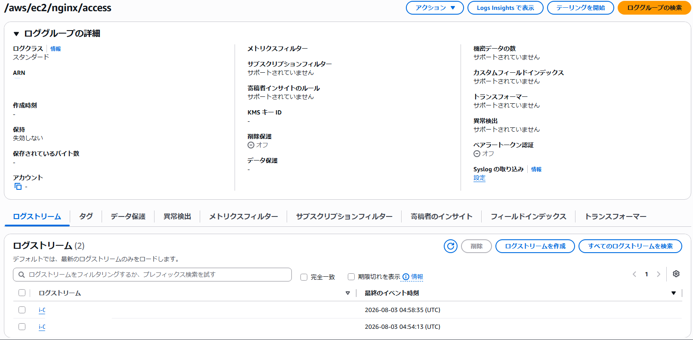
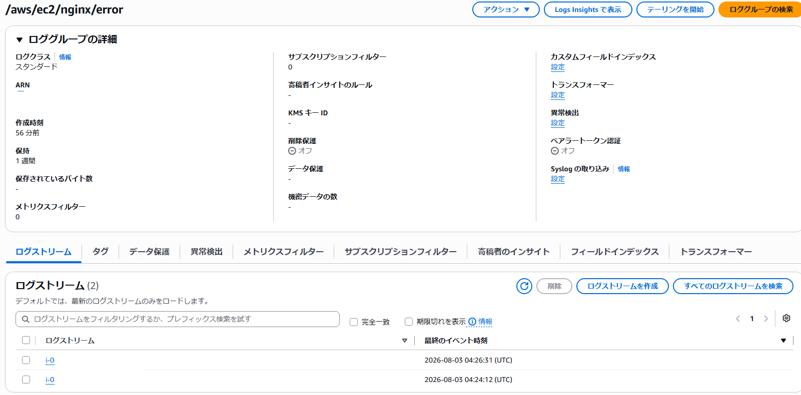

## 検証

スタックが作成されていることを確認しました。

---
EC2インスタンスが作成されていることを確認しました。

---
ALBが作成されて、ターゲットグループが正常に登録されていることを確認しました。

---
ウェブブラウザからNgninxのトップページにアクセスできることと、ページ再読み込みによってインスタンスが切り替わることを確認しました。

---
ロググループを確認し、ログストリームが2つのインスタンスそれぞれに対して作成されていることを確認しました。

