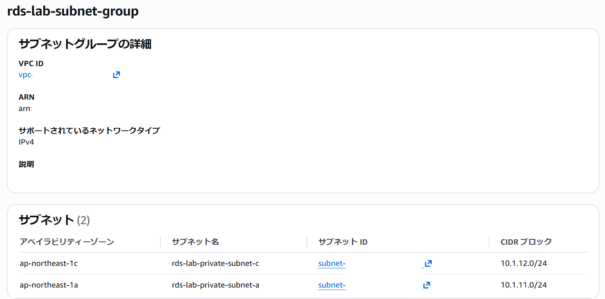
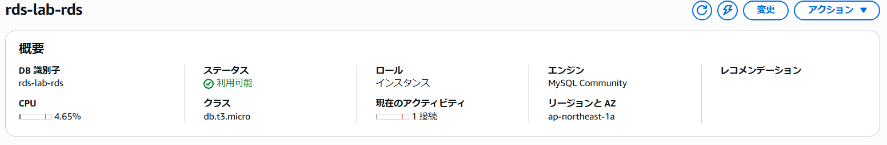
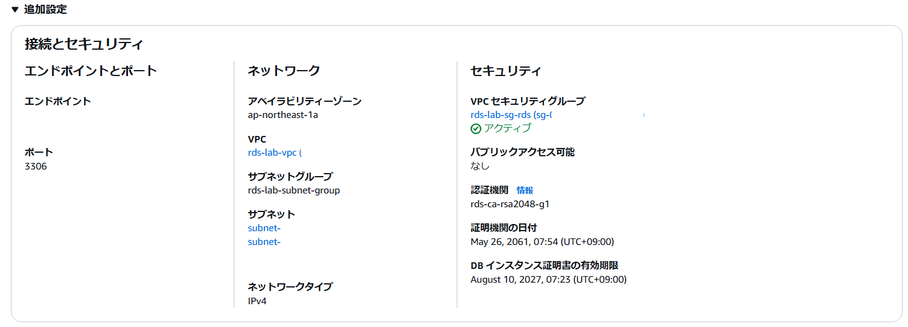
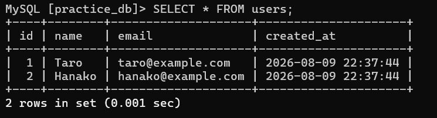
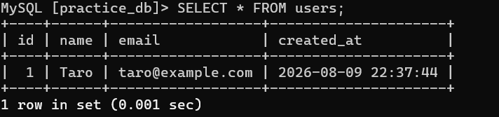

## RDSサブネットグループ作成
サブネットグループを作成しました。



## RDS作成
RDSを作成しました。




## CREATE
SSM接続後、MySQLに接続しました。

```bash
mysql -h rds-lab-rds.xxxxxxxxx.ap-northeast-1.rds.amazonaws.com -P 3306 -u xxxx -p
```

データベース`parctice_db`を作成しました。

```sql
CREATE DATABASE practice_db;
USE practice_db;
```

テーブル`users`を作成しました。

```sql
CREATE TABLE users (
    id INT AUTO_INCREMENT PRIMARY KEY,
    name VARCHAR(100) NOT NULL,
    email VARCHAR(255) NOT NULL,
    created_at TIMESTAMP DEFAULT CURRENT_TIMESTAMP
);
```

## INSERT
テーブル `users` にユーザー情報を2件登録しました。

```sql
INSERT INTO users (name, email)
VALUES
('Taro', 'taro@example.com'),
('Hanako', 'hanako@example.com');
```

## SELECT
テーブル `users` から全てのデータを取得しました。

```sql
SELECT * FROM users;
```


## DELETE
テーブル `users` から `Hanako` のデータを削除し、削除後のデータを確認しました。

```sql
DELETE FROM users
WHERE name = 'Hanako';

SELECT * FROM users;
```

