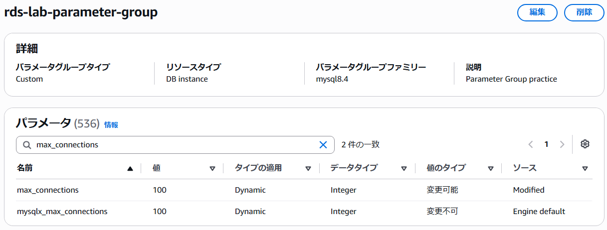
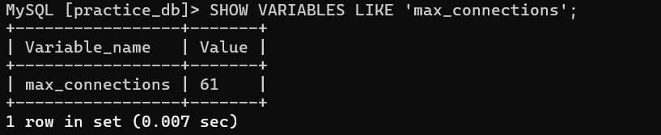
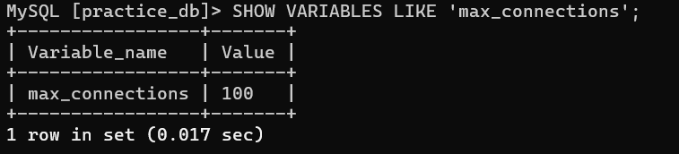

## Parameter Group作成
Parameter Groupを作成しました。

## パラメータ変更
パラメータ `max_connections` の値を `100` に変更しました。

## Parameter Group適用
Parameter Group `rds-parameter-group` をRDS `rds-lab-rds` に適用し、再起動しました。

## 確認
RDSに接続して `max_connections` の値を確認しました。

変更前

---
変更後

