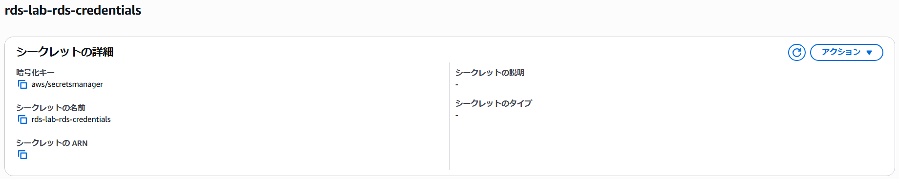
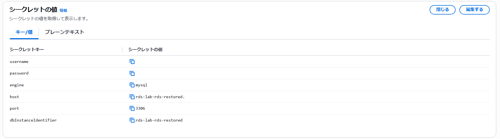
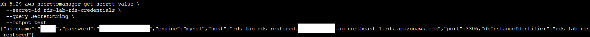

## Secret作成
Secretを作成し、認証情報を入力しました。




## 確認
EC2へSSM接続し、Secretの内容が表示されることを確認しました。

```bash
aws secretsmanager get-secret-value \
  --secret-id rds-lab-rds-credentials \
  --query SecretString \
  --output text
```


