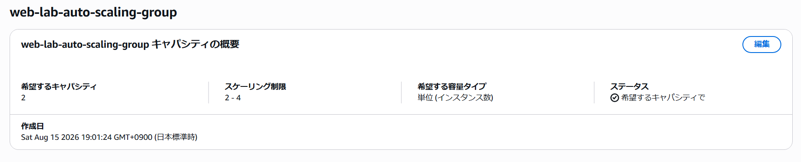
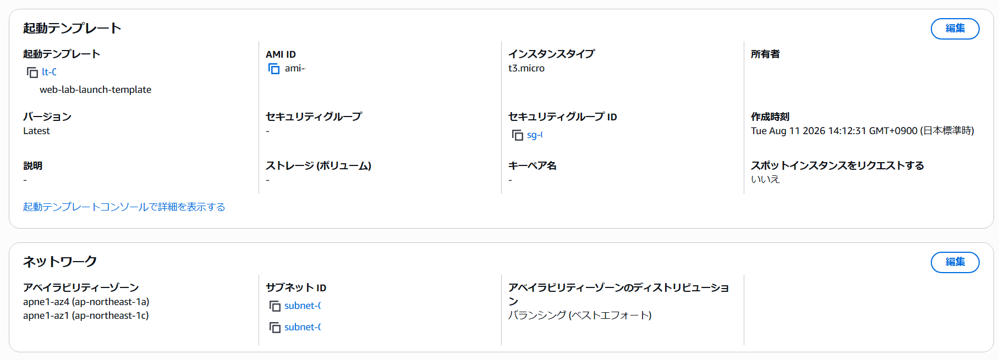
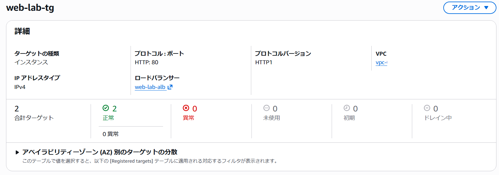
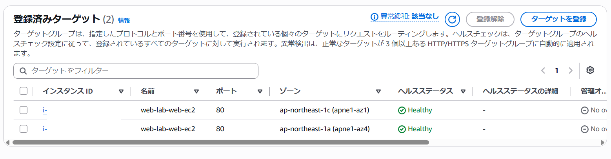
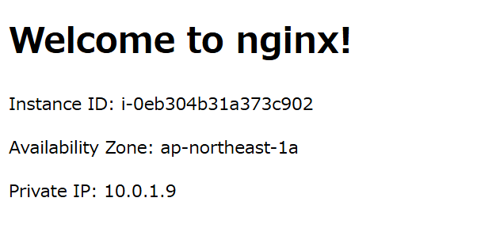
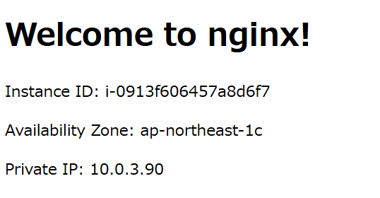

## 起動テンプレート作成

起動テンプレート `web-lab-launch-template` を以下の設定で作成しました。

- AMI: Amazon Linux 2023
- インスタンスタイプ: t3.micro
- キーペア: なし
- サブネット: `web-lab-private-subnet-a`, `web-lab-private-subnet-c`
- アベイラビリティゾーン: ap-northeast-1a, ap-northeast-1c
- セキュリティグループ: `web-lab-web-sg`
- IAMインスタンスプロフィール: `web-lab-web-ec2-role`
- ユーザーデータ: [uesr-data.sh](./user-data.sh) ([02-cloudformation](../02-cloudformation/01-prerequisites.md)で作成したParameterを使用)

## Auto Scaling Group作成

Auto Scaling Group `web-lab-auto-scaling-group` を以下の設定で作成ました。

- 起動テンプレート: `web-lab-launch-template`
- 起動テンプレートのバージョン: Latest
- セキュリティグループ: `web-lab-web-sg`
- VPC: `web-lab-vpc`
- サブネット: `web-lab-private-subnet-a`, `web-lab-private-subnet-c`
- アベイラビリティゾーンのディストリビューション: バランシング（ベストエフォート）
- ロードバランサー: `web-lab-alb`
- ロードバランサーのターゲットグループ: `web-lab-tg`
- 希望する容量: 2
- 最小の希望する容量: 2
- 最大の希望する容量: 4
- Cloudwatch内でのグループメトリクスの収集を有効にする: オン
- タグ: Name: `web-lab-web-ec2`

## 動作確認

インスタンスが2台起動し、ターゲットグループ `web-lab-tg` に登録されていることを確認しました。

ウェブブラウザからALBのDNS名にアクセスし、ページを更新することで2台のEC2インスタンスのインスタンスIDがそれぞれ表示されることを確認しました。

