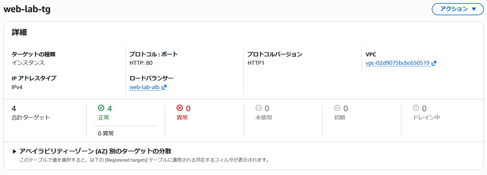
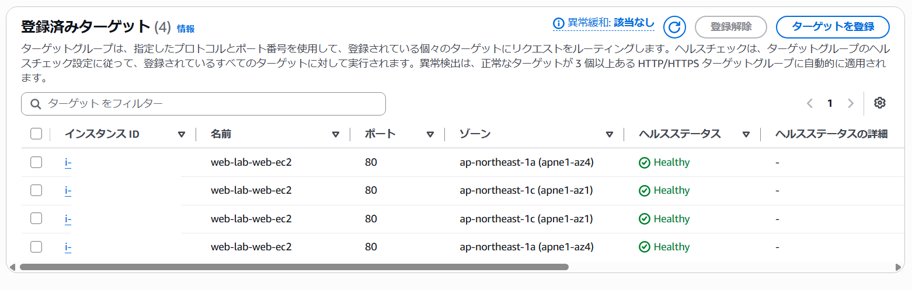
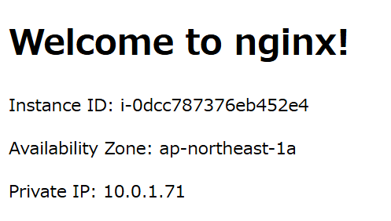
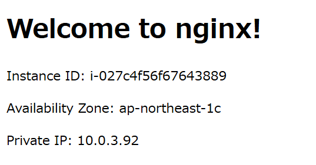
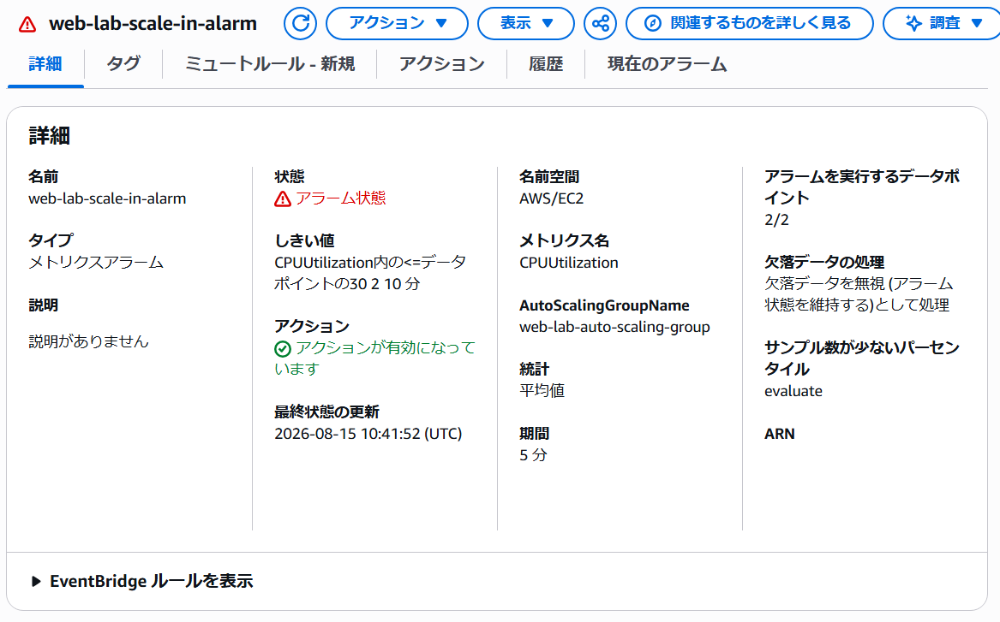
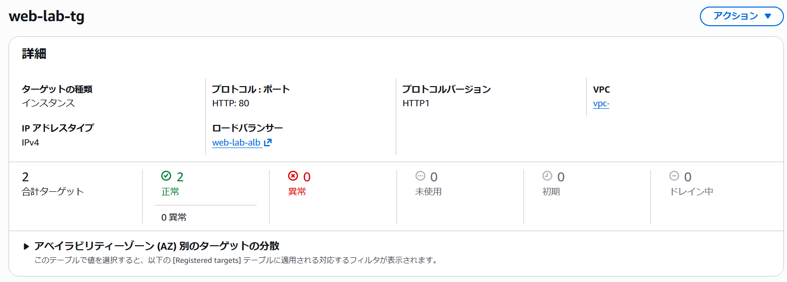
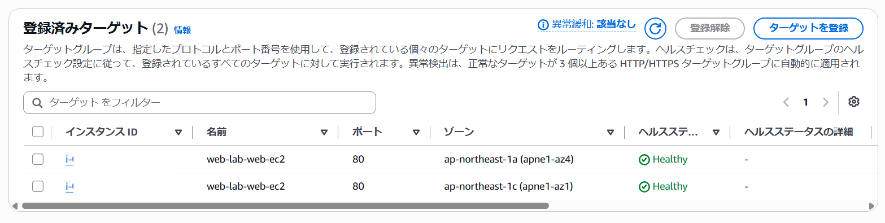
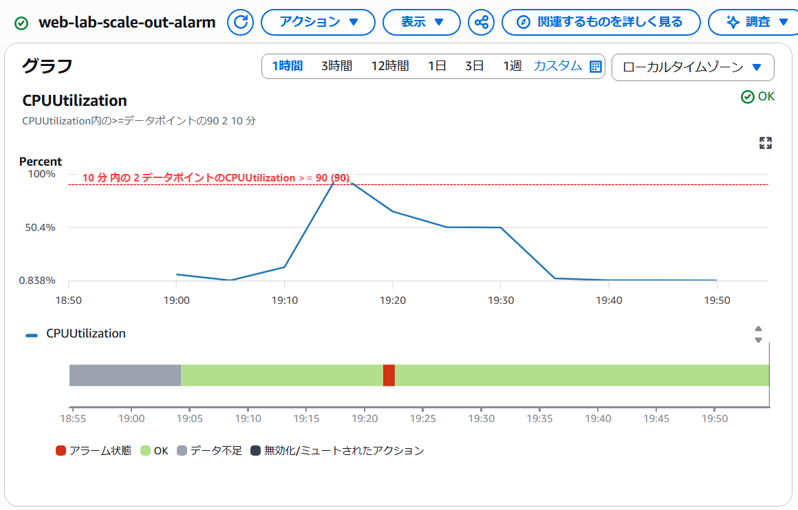
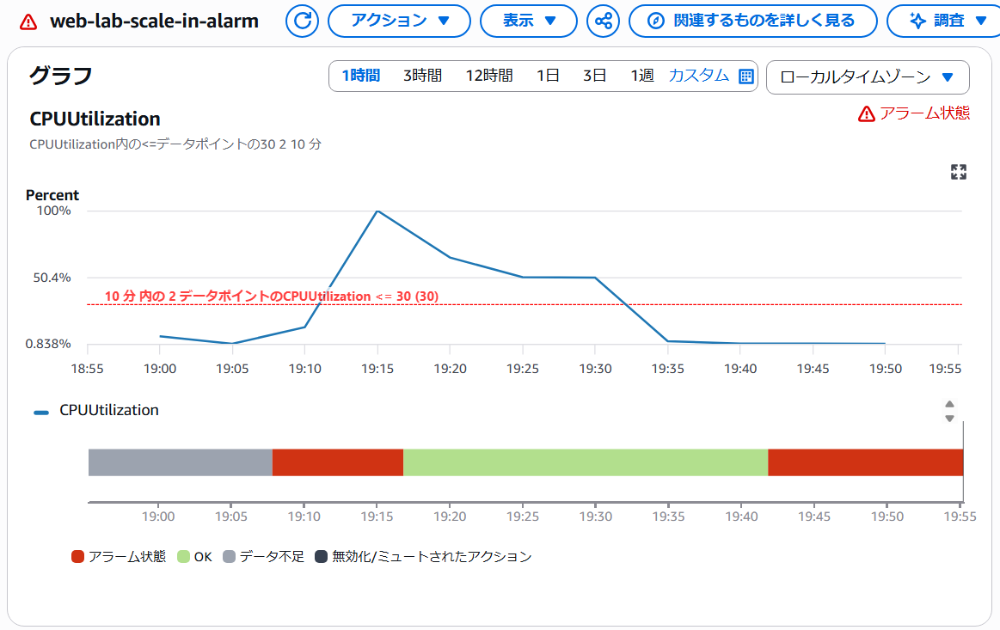

## SNSトピック作成

SNSトピックとサブスクリプションを作成し、AWSから送信された確認メールのリンクをクリックしてサブスクリプションを確認しました。

## アラーム作成

スケールアウト用のCloudWatch Alarm `web-lab-scale-out-alarm` を作成し、CPU使用率90%以上を2回中2回検知するよう設定しました。

スケールイン用のCloudWatch Alarm `web-lab-scale-in-alarm` を作成し、CPU使用率30％以下を2回中2回検知するよう設定しました。

## Auto Scaling Policy作成

`web-lab-scale-out-alarm` をトリガーとして、EC2インスタンスを2台追加するAuto Scalingポリシーを作成しました。

`web-lab-scale-in-alarm` をトリガーとして、EC2インスタンスを2台削除するAuto Scalingポリシーを作成しました。

## Auto Scalingのスケールアウト検証

スケールアウト前の2台のEC2インスタンスにSSMで接続し、nprocコマンドでCPUコア数を確認した後、それぞれでyes > /dev/null &コマンドを実行してCPU負荷をかけました。

---
`web-lab-scale-out-alarm` がアラーム状態になり、`web-lab-scale-in-alarm` がOK状態になることを確認しました。

---
`web-lab-scale-out-alarm` がアラーム状態になったことを知らせる、SNSトピックのサブスクリプションから送信されたメールを確認しました。

---
ターゲットグループに2台の新たなインスタンスが追加され、ヘルスチェックで正常になることを確認しました。

---
ウェブブラウザからALBのDNS名にアクセスし、ページを更新することで新たに追加された2台のEC2インスタンスのインスタンスIDがそれぞれ表示されることを確認しました。

---
`pkill yes` コマンドを実行し、yesプロセスを終了しました。その後、`web-lab-scale-in-alarm` がアラーム状態になることを確認しました。

---
ターゲットグループから2台のインスタンスが削除されたことを確認しました。

---
Cloudwatch Alarmの推移

