## SNSトピック作成

SNSトピックとサブスクリプションを作成し、AWSから送信された確認メールのリンクをクリックしてサブスクリプションを確認しました。

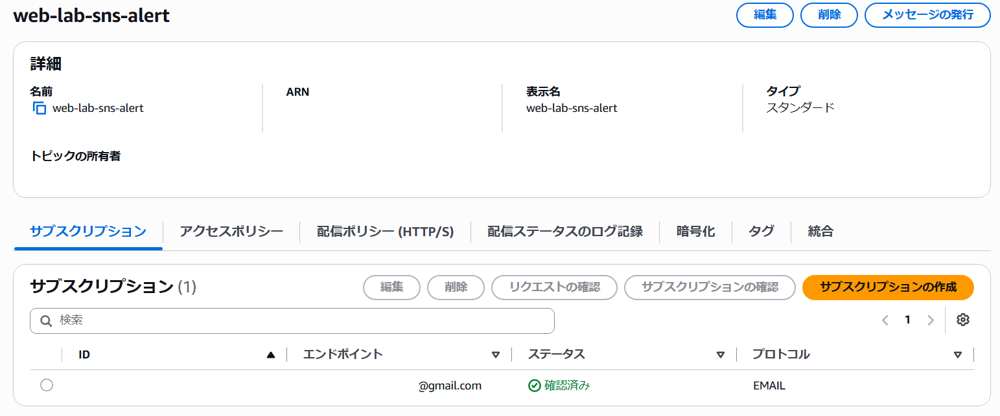

## アラーム作成

スケールアウト用のCloudWatch Alarmを作成し、CPU使用率90%以上を2回中2回検知するよう設定しました。

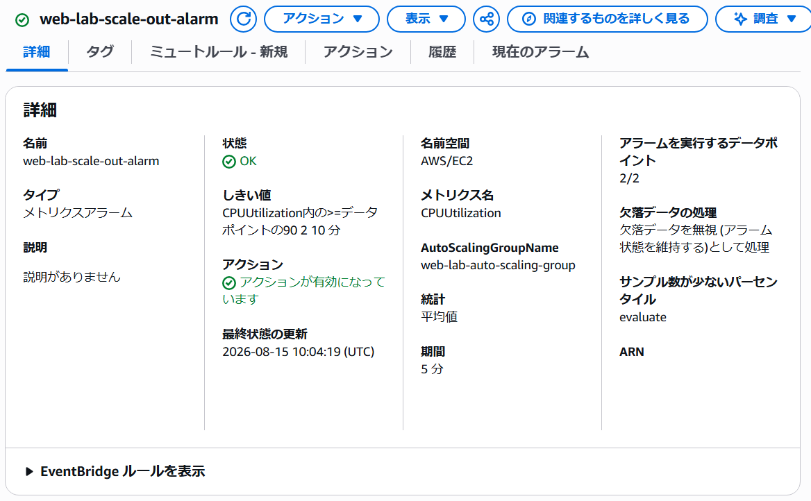

スケールイン用のCloudWatch Alarmを作成し、CPU使用率30％以下を2回中2回検知するよう設定しました。

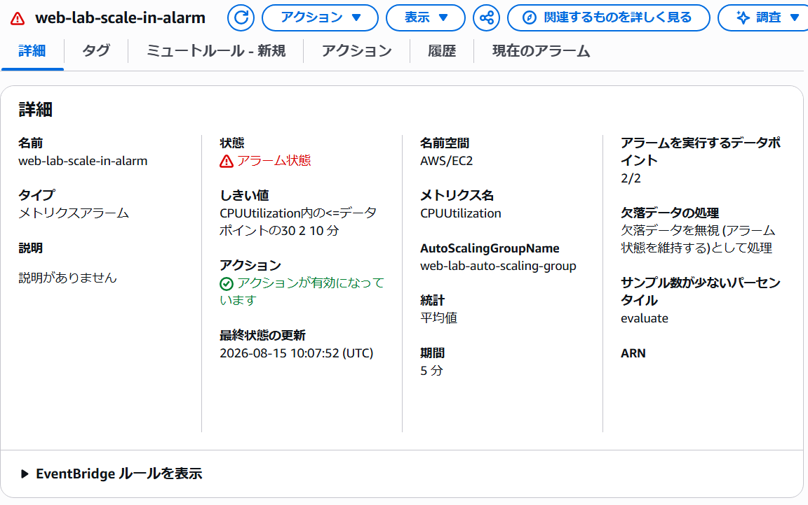

## Auto Scaling Policy作成

スケールアウト用のCloudWatch Alarmをトリガーとして、EC2インスタンスを2台追加するAuto Scalingポリシーを作成しました。

スケールイン用のCloudWatch Alarmをトリガーとして、EC2インスタンスを2台削除するAuto Scalingポリシーを作成しました。

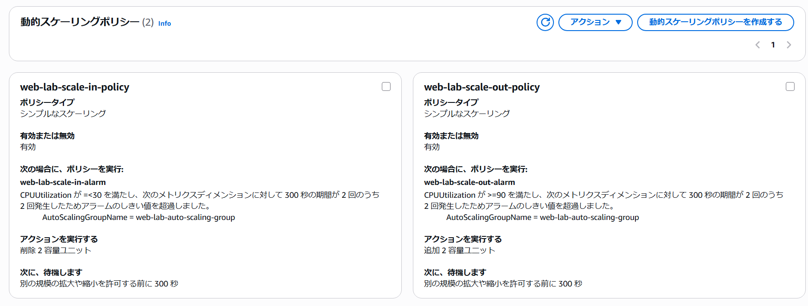

## Auto Scalingのスケールアウト検証

スケールアウト前の2台のEC2インスタンスにSSMで接続し、nprocコマンドでCPUコア数を確認した後、それぞれでyes > /dev/null &コマンドを実行してCPU負荷をかけました。

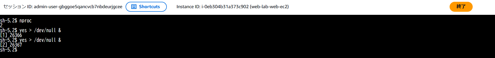
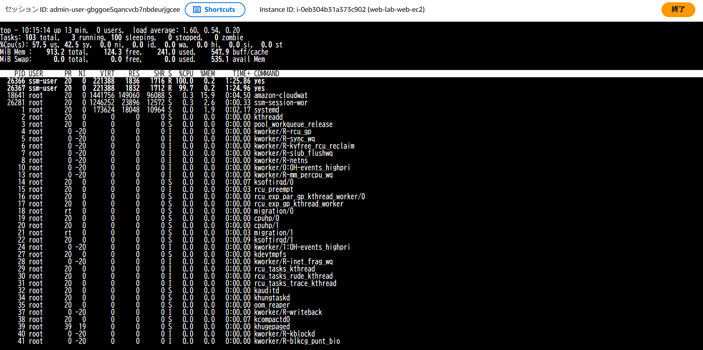
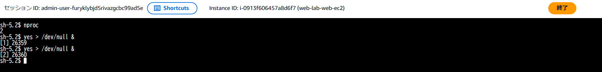
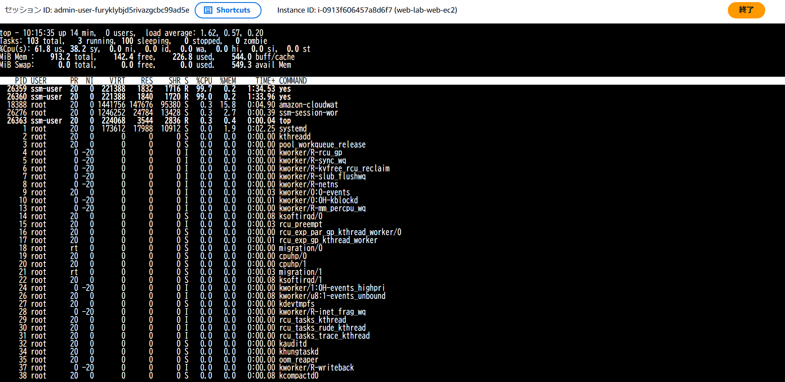

---
スケールアウト用アラームがアラーム状態になり、スケールイン用アラームがOK状態になることを確認しました。

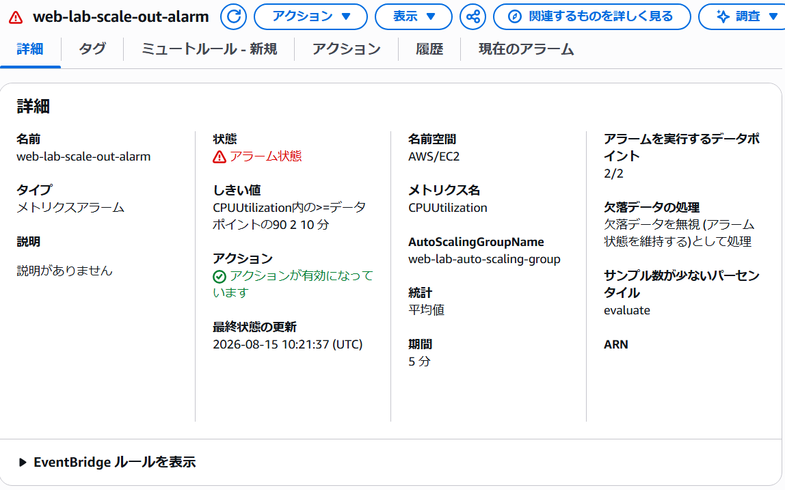
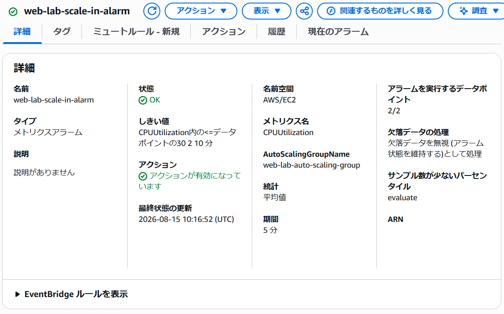

---
スケールアウト用アラームがアラーム状態になったことを知らせる、SNSトピックのサブスクリプションから送信されたメールを確認しました。

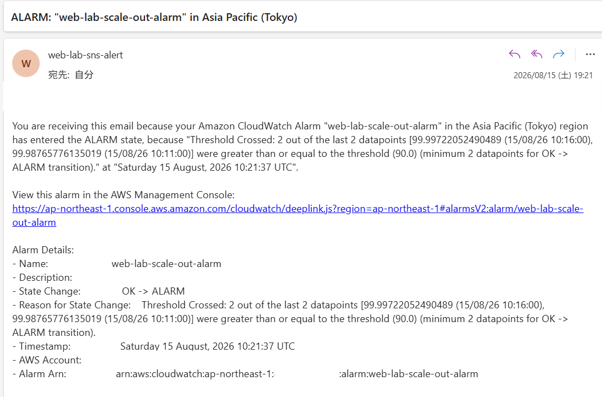

---
ターゲットグループに2台の新たなインスタンスが追加され、ヘルスチェックで正常になることを確認しました。

