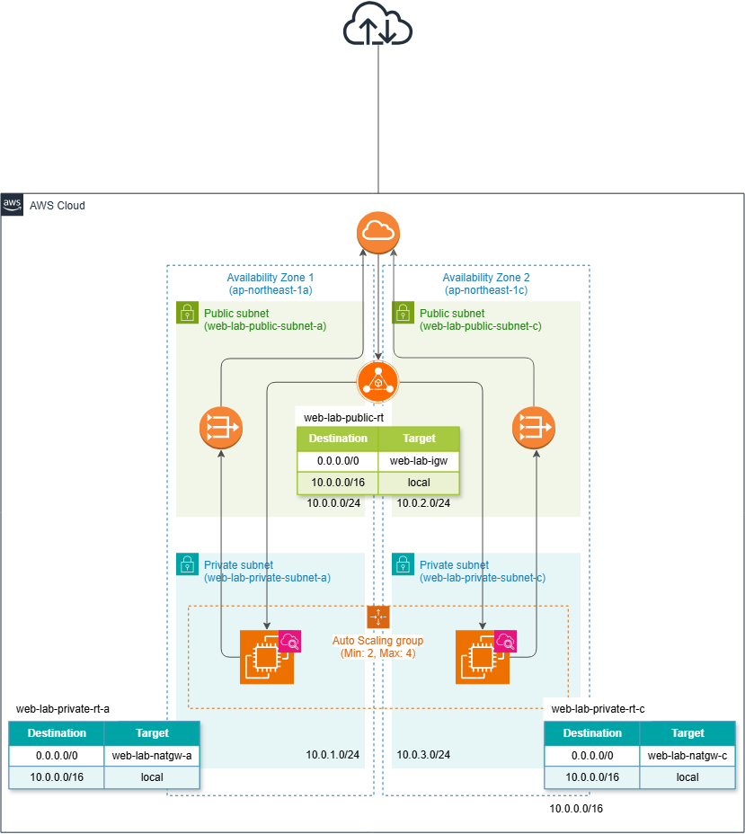

# Amazon EC2 Auto Scalingを利用したスケーリング環境の構築

## 概要

AWS上にApplication Load Balancer（ALB）とAmazon EC2 Auto Scalingを利用した可用性・スケーリング環境を構築しました。

2つのプライベートサブネットにEC2インスタンスを配置し、ALBを経由してWebページへアクセスできる構成を作成しました。

また、CloudWatch AlarmとAuto Scaling Policyを設定し、EC2インスタンスのCPU使用率に応じてスケールアウト・スケールインする構成を実装しました。

さらに、Amazon SNSを利用したアラーム通知を設定し、CPU負荷を発生させることでスケールアウト・スケールインの動作を検証しました。

## 構成図

## 構築手順

- [01. ネットワーク・ALB構築](01-network-alb.md)
- [02. Auto Scaling Group作成](02-auto-scaling-group.md)
- [03. CloudWatch Alarm・Auto Scaling Groupの作成と動作検証](03-cloudwatch-alarm.md)
- [04. リソース削除](04-cleanup.md)
