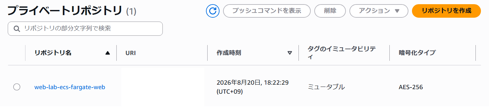
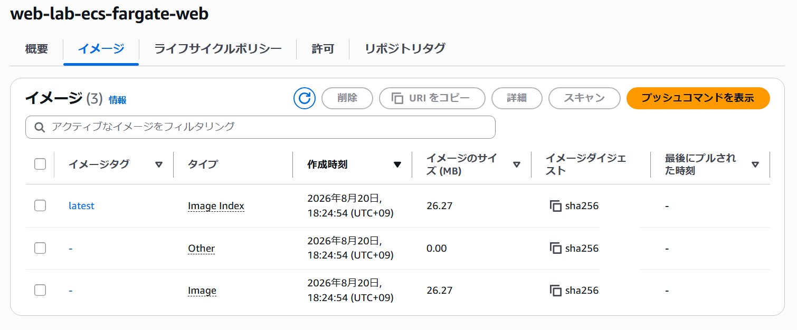

## リポジトリ作成

ECRリポジトリ `web-lab-ecs-fargate-web` を作成しました。



## DockerイメージをECRへPush

ECRへログイン後、DockerイメージにECR用のタグを付与し、Amazon ECRへプッシュしました。

```bash
aws ecr get-login-password --region ap-northeast-1 | docker login --username AWS --password-stdin <AWSアカウントID>.dkr.ecr.ap-northeast-1.amazonaws.com

docker tag ecs-fargate-web:latest <AWSアカウントID>.dkr.ecr.ap-northeast-1.amazonaws.com/web-lab-ecs-fargate-web:latest

docker push <AWSアカウントID>.dkr.ecr.ap-northeast-1.amazonaws.com/web-lab-ecs-fargate-web:latest
```
---
AWSコンソールで、 `web-lab-ecs-fargate-web` にイメージが追加されていることを確認しました。


