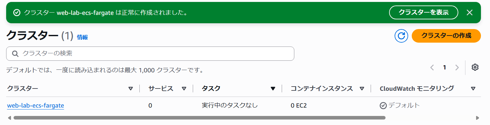
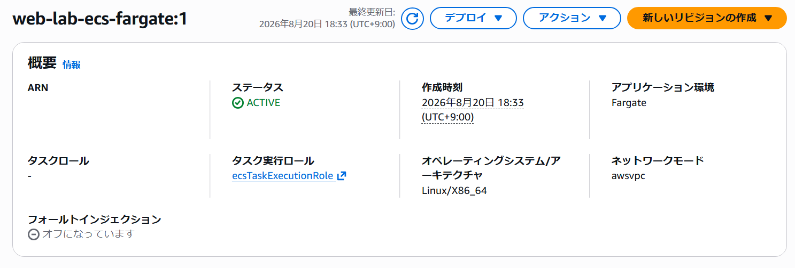
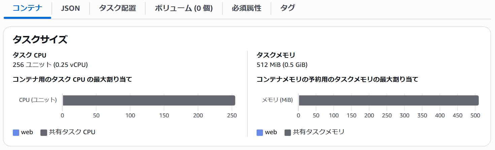

## ECSクラスター作成

ECSクラスター `web-lab-ecs-fargate` を作成しました。

## タスク定義作成

タスク定義 `web-lab-ecs-fargate` を以下の設定で作成しました。

- タスク定義ファミリー: `web-lab-ecs-fargate`
- 起動方式: Fargate
- タスク実行ロール: 新たに作成
- CPU: 0.25 vCPU
- メモリ: 0.5 GB
- ロググループの自動作成: オン
- ロググループ名: /web-lab/ecs-fargate

