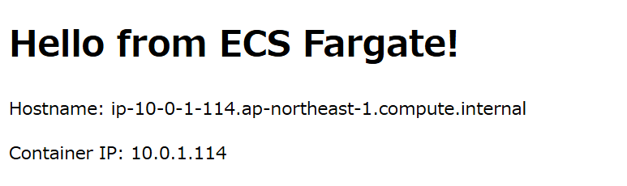
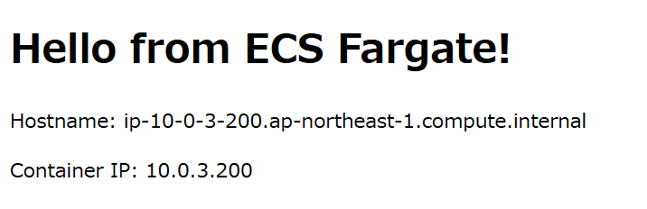

## ECSサービス作成

ECSサービス `web-lab-ecs-fargate-service` を以下の設定で作成しました。
- タスク定義ファミリー: `web-lab-ecs-fargate`
- タスク定義のリビジョン: 2
- 起動タイプ: Fargate
- 必要なタスク: 2
- VPC: `web-lab-vpc`
- サブネット: `web-lab-private-subnet-a`, `web-lab-private-subnet-c`
- セキュリティグループ: `web-lab-ecs-fargate-sg`
- パブリックIP: オフ
- ロードバランサー: ALB `web-lab-alb`
- リスナーポート番号: 80
- リスナープロトコル: HTTP
- ターゲットグループ: `web-labtg-ecs-fargate`

## ECSサービス確認

ECSサービス起動後、ターゲットグループに2つのターゲットが登録されていることを確認しました。

ロードバランサーのDNS名にブラウザからアクセスし、ページをリロードすることで、各タスクのホスト名とIPアドレスが表示されることを確認しました。

---

