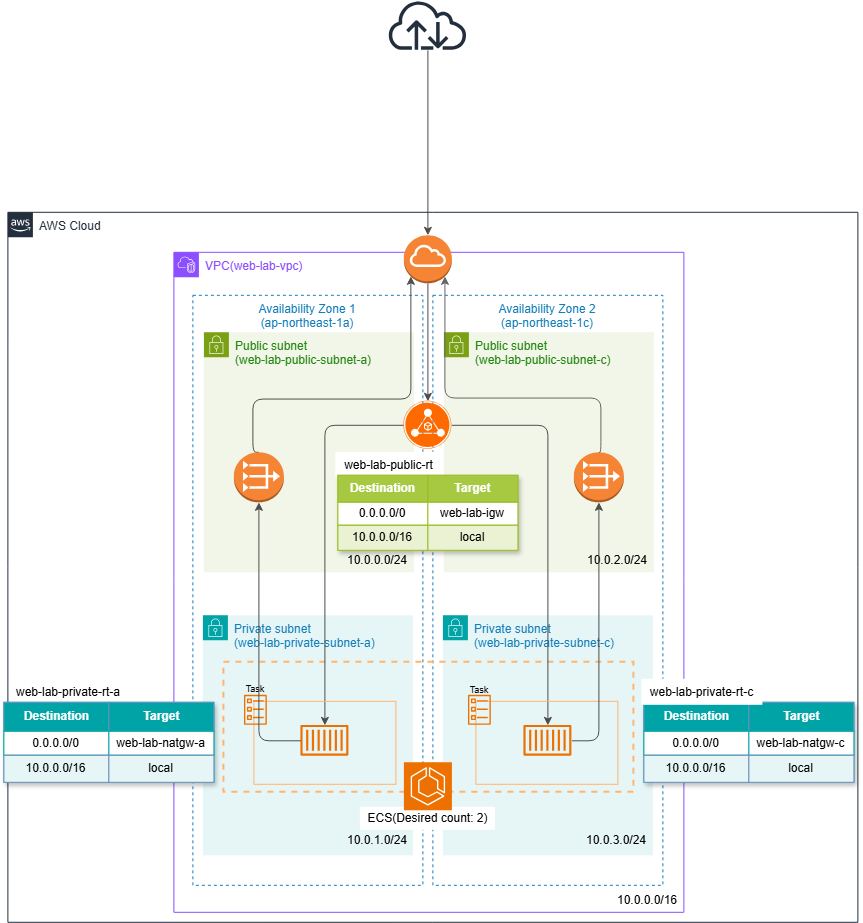

# Amazon ECS Fargateを利用したコンテナWebシステムの構築

## 概要

AWS上にAmazon ECS Fargateを利用したコンテナWebシステムを構築しました。

Dockerでnginxをコンテナ化し、Amazon ECRに登録したDockerイメージをECS Fargate上で実行しました。

また、Application Load Balancer（ALB）をFargate Serviceと連携し、複数のTaskへの負荷分散とTask停止時の自動復旧を確認しました。

さらに、Amazon CloudWatch Logsを利用してコンテナのログを収集・確認しました。

## 構成図

## 構築手順

- [01. ネットワーク・ALB構築](01-network-alb.md)
- [02. ローカルでの動作確認](02-local.md)
- [03. ECSクラスター・タスク定義作成](03-cluster.md)
- [04. ECRリポジトリ作成](04-ecr.md)
- [05.ECSサービス作成・確認](05-ecs.md)
- [06. 自動復旧確認](06-task-recovery.md)
- [07. CloudWatchログ確認](07-cloudwatch.md)
- [08. リソース削除](08-cleanup.md)

