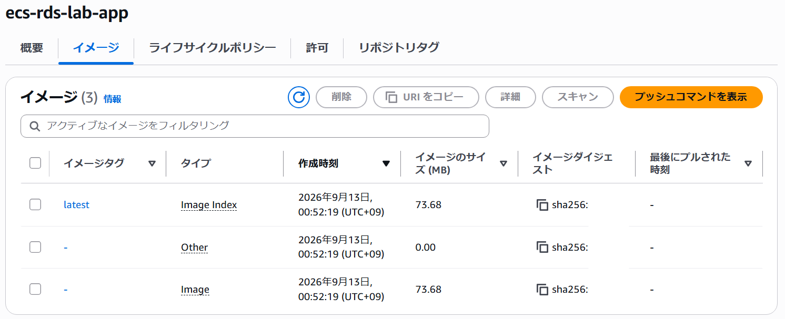

## 各ファイルの作成
今回の構成に必要な3つのファイルと、localでの動作確認のために必要な1つのファイルを作成しました。
- [Dockerfile](./Dockerfile): Flaskアプリケーション用Dockerイメージの定義
- [app.py](./app.py): Flaskアプリケーション本体。MySQLへ接続してデータを取得
- [requirements.txt](./requirements.txt): Pythonの必要パッケージを定義
- [compose.yml](./compose.yml): FlaskとMySQLのコンテナ構成を定義。localでの動作確認用


## Local環境での動作確認

AWS環境を構築する前に、Docker Composeを使用してFlaskアプリケーションとMySQLをローカル環境でコンテナ化し、アプリケーションからデータベースへ接続できることを確認しました。

## リポジトリ作成

ECRリポジトリ `ecs-rds-lab-app` を作成しました。

## DockerイメージをECRへPush

ECRへログイン後、DockerイメージにECR用のタグを付与し、Amazon ECRへプッシュしました。

```bash
aws ecr get-login-password --region ap-northeast-1 | docker login --username AWS --password-stdin <AWSアカウントID>.dkr.ecr.ap-northeast-1.amazonaws.com

docker tag ecs-rds-lab-app:latest <AWSアカウントID>.dkr.ecr.ap-northeast-1.amazonaws.com/ecs-rds-lab-app:latest

docker push <AWSアカウントID>.dkr.ecr.ap-northeast-1.amazonaws.com/ecs-rds-lab-app:latest
```
---
AWSコンソールで、 `ecs-rds-lab-app` にイメージが追加されていることを確認しました。


