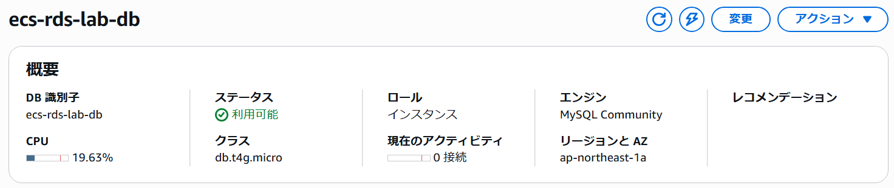
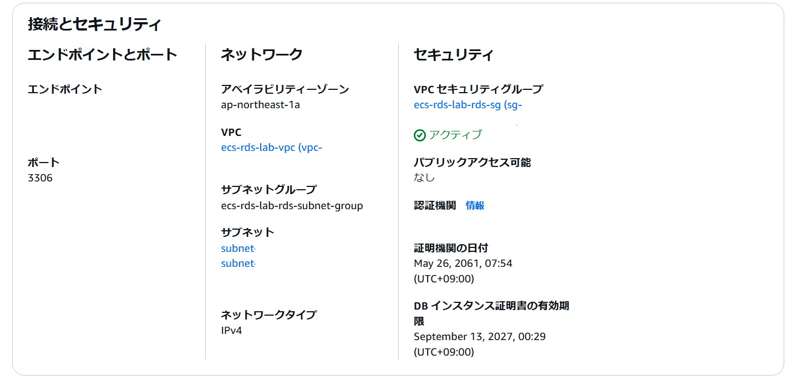
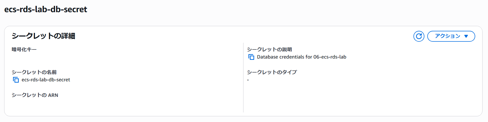
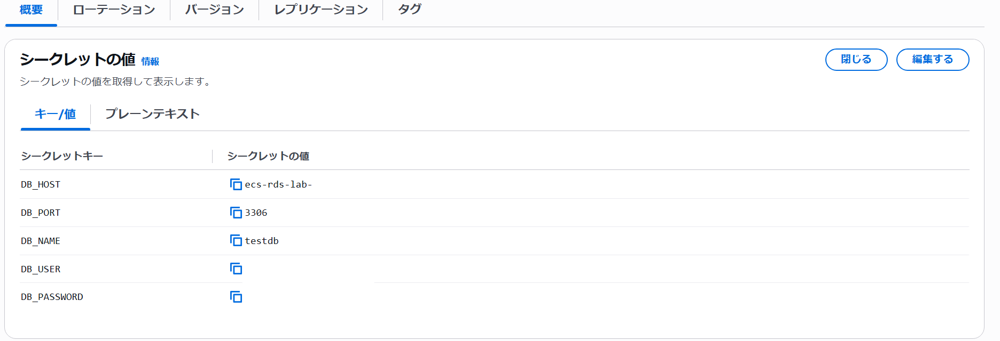
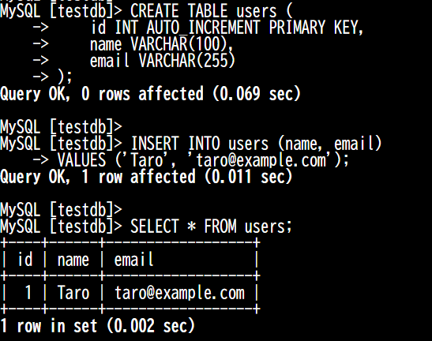

## RDS作成
サブネットグループとRDSを作成しました。




## Secretの作成
RDSへの接続情報をSecrets Managerで管理し、ECS Taskから取得してDB接続に利用するため、Secret `ecs-rds-lab-db-secret` を作成しました。
なお、一部の値についてはセキュリティ上の理由から記載していません。




## EC2インスタンスから接続
`ecs-rds-lab-public-subnet-a` 上にEC2インスタンスを作成しました。

`ecs-rds-lab-rds-sg` にEC2インスタンスにアタッチしたセキュリティグループからの通信を許可するインバウンドルールを追加しました。

SSMからEC2インスタンスに接続後、MySQLクライアントをインストールし、RDSにログインしました。

```bash
sudo dnf install mariadb105 -y
mysql -h <RDSエンドポイント> -P 3306 -u <ユーザー名> -p
```

## テーブルの作成
`users` テーブルを作成し、作成したデータを取得できることを確認しました。

```sql
USE testdb;

CREATE TABLE users (
    id INT AUTO_INCREMENT PRIMARY KEY,
    name VARCHAR(100),
    email VARCHAR(255)
);



INSERT INTO users (name, email)
VALUES ('Taro', 'taro@example.com');

SELECT * FROM users;
```
