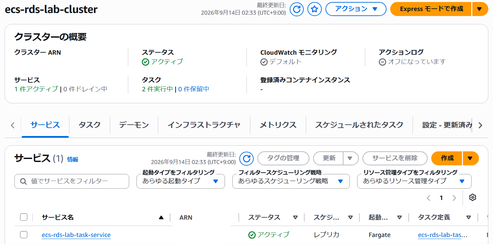
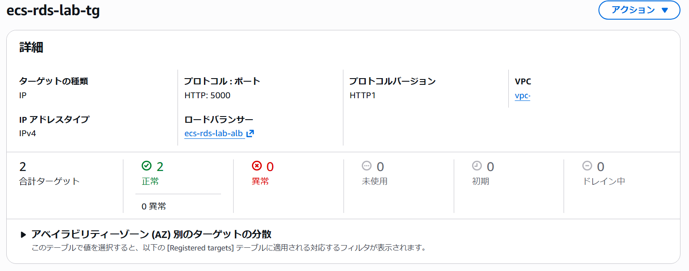
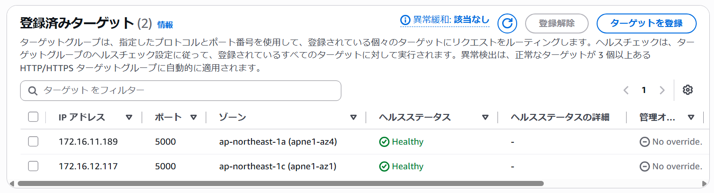
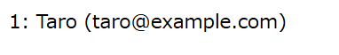
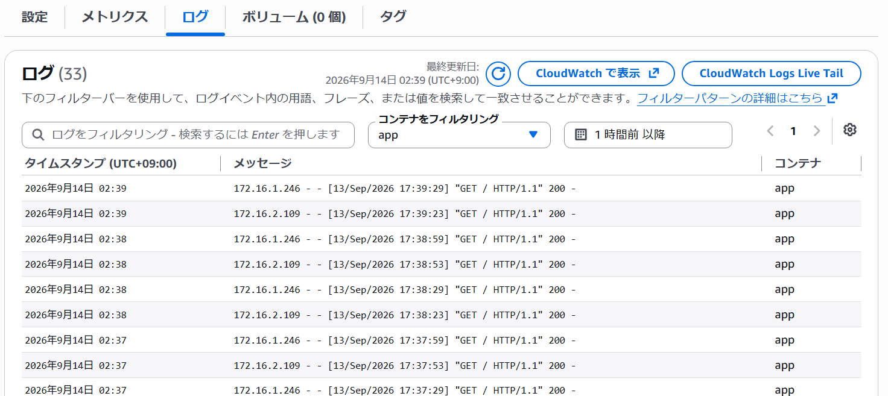

## ECSサービス作成

タスク定義及びECSクラスター`ecs-rds-lab-cluster`を作成した後、ECSサービス `ecs-rds-lab-task-service` を以下の設定で作成しました。
- タスク定義ファミリー: `ecs-rds-lab-task`
- タスク定義のリビジョン: 1
- 起動タイプ: Fargate
- 必要なタスク: 2
- VPC: `ecs-rds-lab-vpc`
- サブネット: `ecs-rds-lab-private-ecs-subnet-a`, `ecs-rds-lab-private-ecs-subnet-c`
- セキュリティグループ: `ecs-rds-lab-ecs-sg`
- パブリックIP: オフ
- ロードバランサー: ALB `ecs-rds-lab-alb`
- リスナーポート番号: 5000
- リスナープロトコル: HTTP
- ターゲットグループ: `ecs-rds-lab-tg`

## サービス起動確認
`ecs-rds-lab-task-service` を起動し、`ecs-rds-lab-tg` に2つのターゲットが正常に登録されていることを確認しました。

ALBのDNS名でブラウザからアクセスし、RDSにアップロードした内容が表示されることを確認しました。

## ログ確認
ECSタスクのログが正常に表示されることを確認しました。

