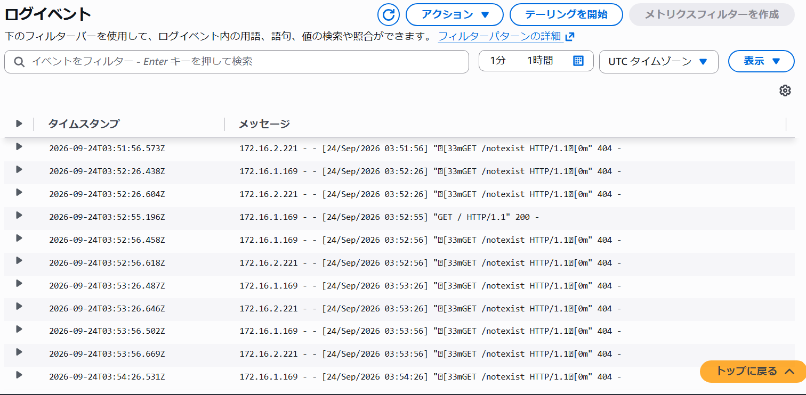

# ALBのヘルスチェックパスを意図的に変更して、ECSタスクのUnhealthyを確認する

## ヘルスチェックパスの変更
ALBのターゲットグループで、ヘルスチェックパスを `/` から、存在しない `/notexist` に変更しました。
これにより、意図的にヘルスチェックを失敗させました。

## 原因の特定
タスクは正常に実行されていることを確認しました。

---
ヘルスチェックで404が発生している原因を調査するため、CloudWatch Logsを確認しました。
`GET /notexist HTTP/1.1` に対して404が返されていることを確認しました。

あわせて通常の/へのリクエストを確認したところ、200が返されていることを確認しました。
アプリケーション自体は応答しており、ヘルスチェックのパスに問題がある可能性があると判断しました。

