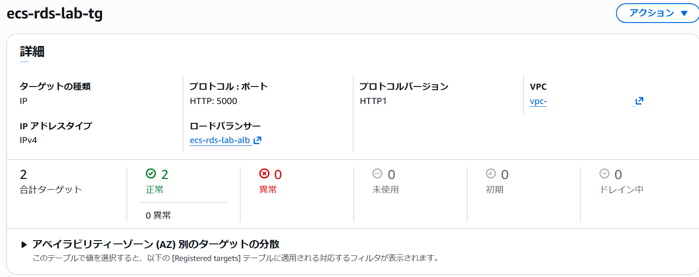
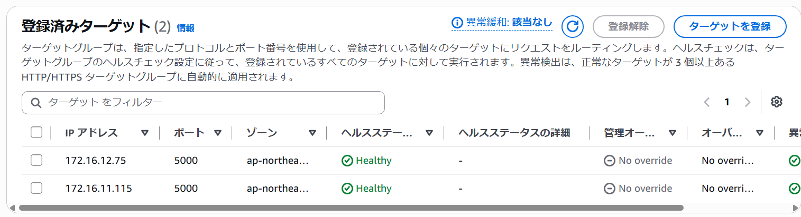
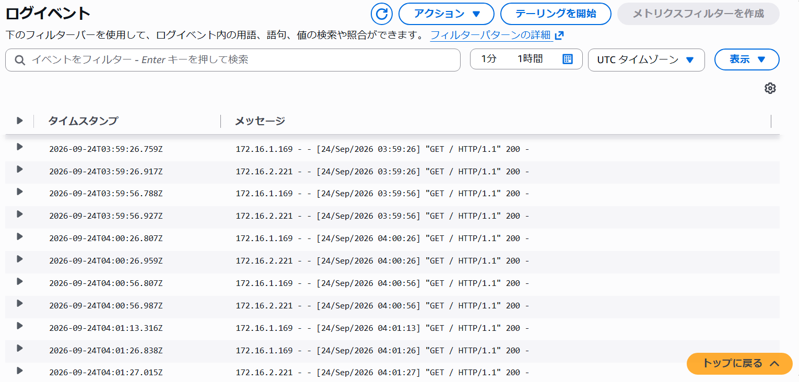

# ALBのヘルスチェックパスを意図的に変更して、ECSタスクのUnhealthyを確認する

## ヘルスチェックパスの変更
ALBのターゲットグループで、ヘルスチェックパスを `/` から、存在しない `/notexist` に変更しました。
これにより、意図的にヘルスチェックを失敗させました。


## 原因の特定
タスクは正常に実行されていることを確認しました。


---
ヘルスチェックで404が発生している原因を調査するため、CloudWatch Logsを確認しました。
`GET /notexist HTTP/1.1` に対して404が返されていることを確認しました。

あわせて通常の/へのリクエストを確認したところ、200が返されていることを確認しました。
アプリケーション自体は応答しており、ヘルスチェックパスに問題がある可能性があると判断しました。


---
[app.py](../06-ecs-rds/app.py)を確認し、Flaskで定義されているルートを確認しました。
`/` は定義されていますが、 `/notexist` は定義されていないことを確認しました。

```python
@app.route("/")
def index():
```

## 復旧
ヘルスチェックパスを `/notexist` から、`/` に修正後、ターゲットグループの状態を確認し、Healthyとなったことを確認しました。




