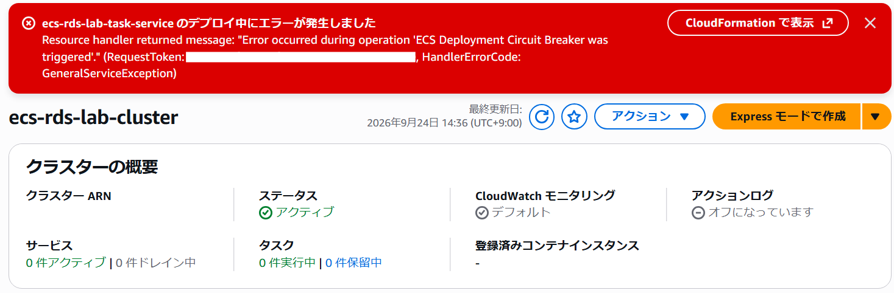
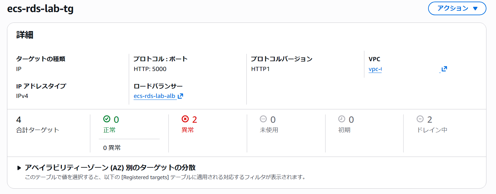
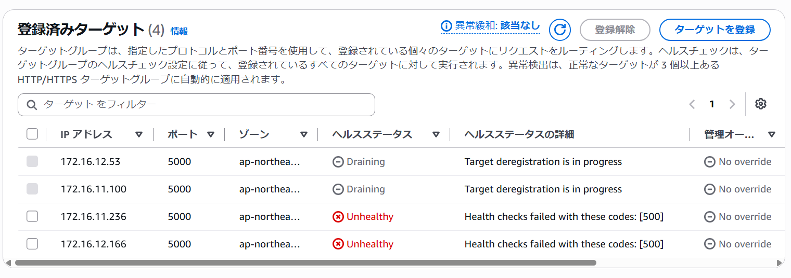
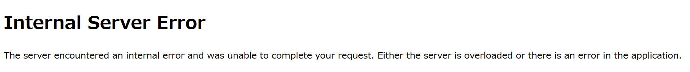
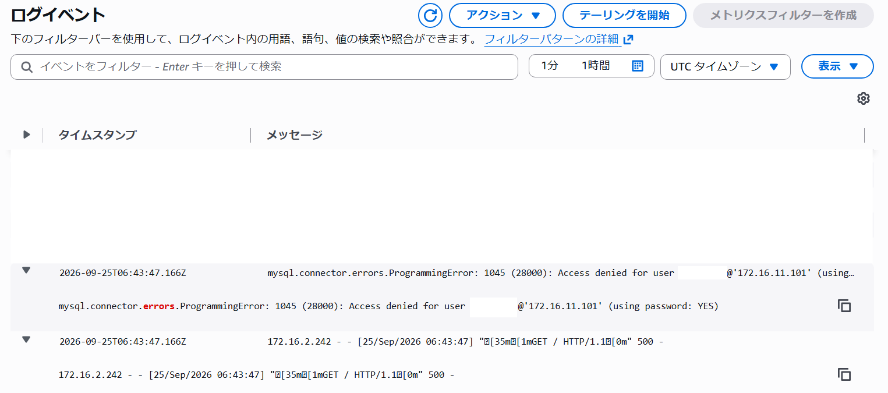
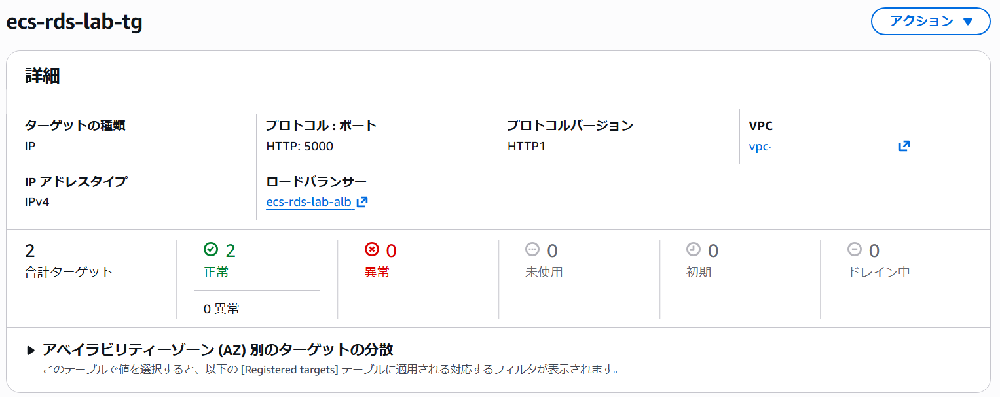
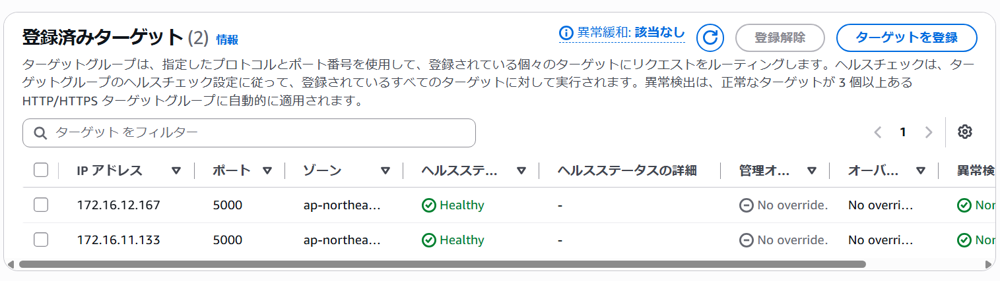

# Secretに保存しているパスワードの値を変更し、ＤＢ接続エラーを発生させる

## Secretの変更
Secrets Manager の `DB_PASSWORD` の値を実際のRDS接続に使用しているパスワードとは異なる値に変更し、DB接続エラーが発生する状態にしました。

---
ブラウザからもアクセスできないことを確認しました。

## 原因の特定
Cloudwatch Logs でログを確認しました。

エラーコード1045が発生していることから、DB接続時の認証に失敗していることを確認しました。

## 復旧
Secrets Manager の `DB_PASSWORD` を正しい値に戻し、再デプロイしました。

---
ヘルスステータスがhealthyになっていることを確認しました。

---
ブラウザからも正常にアクセスできることを確認しました。

