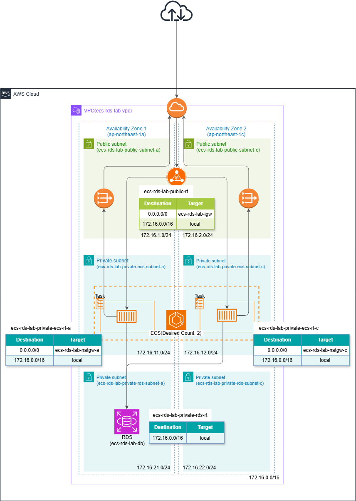

# コンテナWebシステムのトラブルシューティング

## 概要
06で構築したコンテナWebシステムに対して、意図的に障害を発生させ、トラブルシューティングの練習を行いました。

障害発生後、AWSコンソールで各リソースの状態を確認し、CloudWatch Logsなどから得られる情報をもとに原因を調査・特定し、復旧までの一連の障害対応を実践しました。

## 構成図

## トラブルシューティング

- [01. イメージタグの誤設定](01-imagetag.md)
- [02. ヘルスチェックパスの誤設定](02-healthcheckpath.md)
- [03. シークレットに保存したパスワードの誤設定](03-rds.md)
- [04. ECSの作成・動作確認](04-ecs.md)
